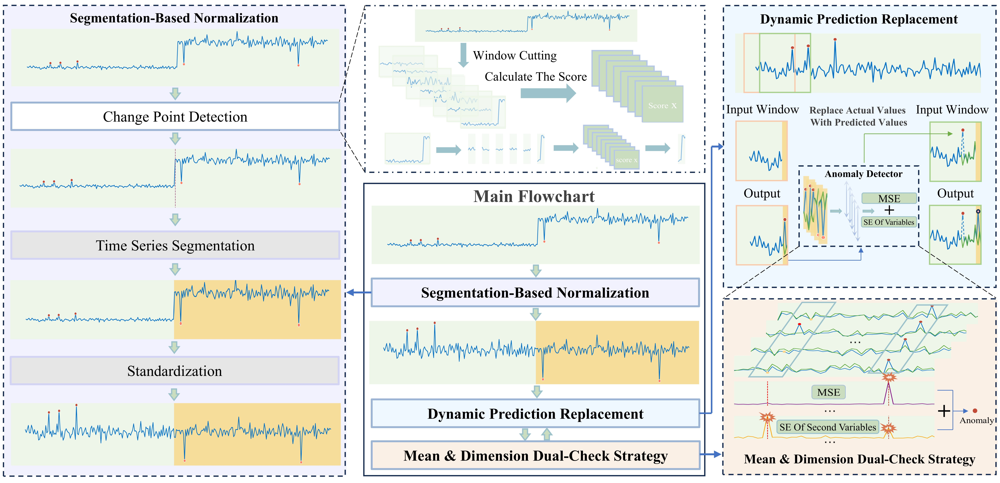
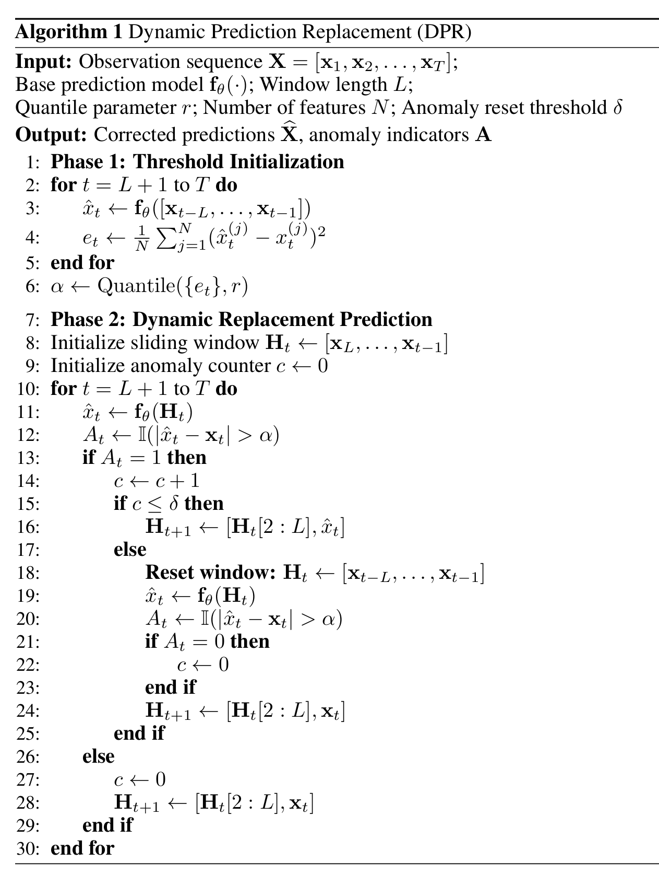
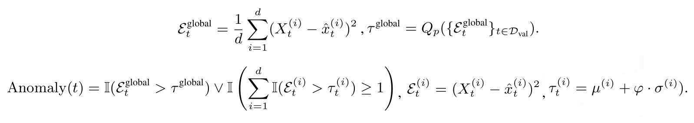
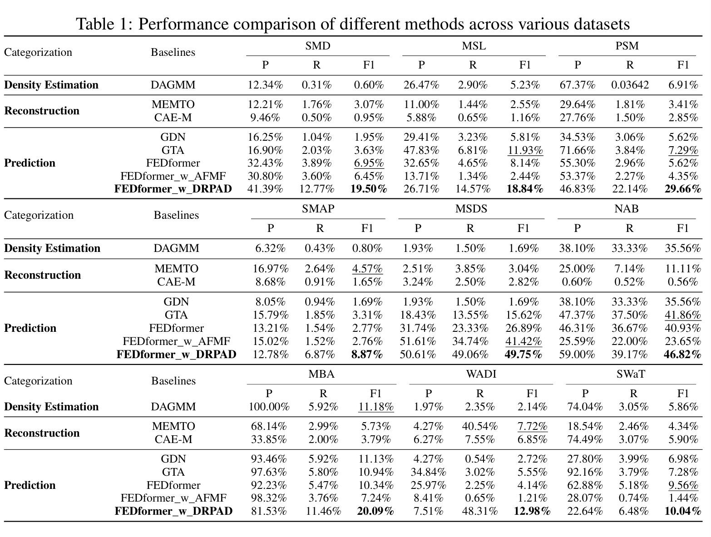

## Components of DRPAD

### Dynamic Prediction Replacement (DPR)
To mitigate the propagation of anomalies, we introduce a dynamic prediction replacement mechanism. This component dynamically updates identified anomalous points with their predicted values, thereby suppressing their disruptive effects on future predictions and significantly enhancing overall detection performance.

### Segmentation-Based Normalization via Change Point Detection(SN)
To address distribution shifts, we propose a segmentation-based normalization approach. Specifically, the time series is divided into statistically independent segments using change point detection, and each segment is normalized individually. The segments are then reassembled to restore the original temporal structure. This process ensures a consistent statistical scale across segments, effectively mitigating the impact of distributional heterogeneity
### Mean \& Dimension Dual-Check Strategy(MDDC)
To improve the detection of univariate anomalies, we develop a hybrid thresholding approach based on multidimensional sensitivity. This strategy combines global statistical indicators with per-dimension checks to better capture subtle and localized deviations.



## Data
We reuse the original datasets and preprocessing routines provided by [AFMF](https://github.com/OrigamiSL/AFMF?tab=readme-ov-file). SMD, MSL, SMAP, SMD datasets were acquired at [datasets](https://drive.google.com/drive/folders/1gisthCoE-RrKJ0j3KPV7xiibhHWT9qRm?usp=sharing) and SWaT, WADI can be requested at [Itrust](https://itrust.sutd.edu.sg/itrust-labs_datasets). MBA, UCR, NAB was acquired at [TranAD datasets](https://github.com/imperial-qore/TranAD/tree/main/data/) and MSDS can be requested at [zenodo](https://zenodo.org/record/3549604). Pruned and remedied {SMD, MSL, SMAP} were acquired at [TranAD datasets](https://github.com/imperial-qore/TranAD/tree/main/data/).

## Data Preparation

All data Preparation are same as [AFMF](https://github.com/OrigamiSL/AFMF?tab=readme-ov-file) framework.
After you acquire raw data of all datasets, please separately place them in corresponding folders at `./DRPAD/data`. Then you can get the folder tree shown as below:
```
|-data
| | preprocess.py
| | data_loader.py
| |-MBA
| | |-labels.xlsx
| | |-test.xlsx
| | |-train.xlsx
| |
| |-MSDS
| | |-concurrent_data
| | | |-logs
| | | |-logs_aggregated_concurrent.csv
| | | |-metrics
| | | | |-wally113_metrics_concurrent.csv
| |
| |-MSL
| | |-test
| | | |-C-1.npy
| | |-train
| | | |-C-1.npy
| | |-labeled_anomalies.csv
| | |-MSL_test.npy
| | |-MSL_test_label.npy
| | |-MSL_train.npy
| |
| |-NAB
| | |-ec2_request_latency_system_failure.csv
| | |-labels.json
| |
| |-PSM
| | |-test.csv
| | |-test_label.csv
| | |-train.csv
| |
| |-SMAP
| | |-test
| | | |-P-1.npy
| | |-train
| | | |-P-1.npy
| | |-labeled_anomalies.csv
| | |-SMAP_test.npy
| | |-SMAP_test_label.npy
| | |-SMAP_train.npy
| |
| |-SMD
| | |-labels
| | | |-machine-1-1.txt
| | |-test
| | | |-machine-1-1.txt
| | |-train
| | | |-machine-1-1.txt
| | |-SMD_test.npy
| | |-SMD_test_label.npy
| | |-SMD_train.npy
| |
| |-SWaT
| | |-SWaT_Dataset_Attack_v0.xlsx
| | |-SWaT_Dataset_Normal_v1.xlsx
| |
| |-UCR
| | |-137_UCR_Anomaly_InternalBleeding18_2300_4485_4587.txt
| |
| |-WADI
| | |-WADI_14days_new.csv
| | |-WADI_attackdataLABLE.csv

```
Then you can run  `./DRPAD/data/preprocess.py`  to preprocess these raw data. 

## Usage
Commands for training and testing models combined with DRPAD of all datasets are in ./scripts/<model>.sh.

## Results
The experiment parameters of certain model under each data set are formated in the <model>.sh files in the directory ./scripts/. You can refer to these parameters for experiments, and you can also adjust the parameters to obtain better results.


## Acknowledgement

This project is an improvement based on the AFMF framework. We would like to thank the authors of AFMF for sharing their datasets and data preprocessing scripts, which provided the foundation for our work.

You can find the original AFMF repository here: [AFMF GitHub Repository]([https://github.com/xxx/AFMF](https://github.com/OrigamiSL/AFMF))

